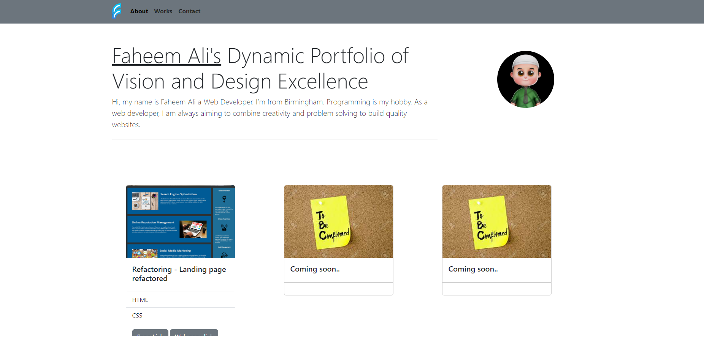

# Portfolio Website with Bootstrap

Welcome to my portfolio website used making Bootstrap. This is a showcase of my web development skills and projects. The website is built using HTML and Bootstrap. It highlights my work, provides information about me, and offers a way to get in touch.

## Features
- **About Me:** Learn more about who I am and my passion for web development.
- **My Work:** Explore the projects I've worked on, complete with previews and descriptions.
- **Contact Me:** Find a way to contact me if you're interested in collaborating or have any questions.

## Technologies Used
- **HTML:** Used for structuring the content of the website.
- **Bootstrap:** Used for responsive design and pre-built components.

## How to Use
To view my portfolio web page, simply open the `index.html` file in your preferred web browser. You can also access the deployed version online: [View Portfolio Website](https://b70b70.github.io/portfolio_website_v2_w_bootstrap/)

This portfolio effort was carried out by Faheem Ali.